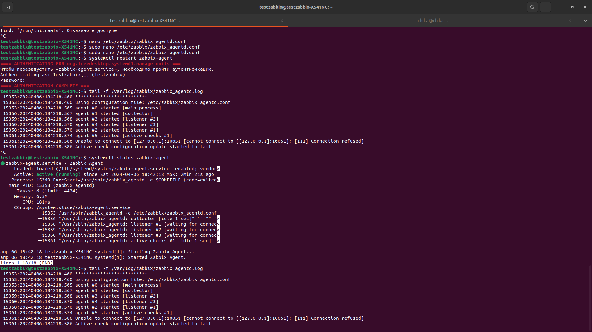

# Домашнее задание к занятию "`Система мониторинга Zabbix`" - `Kolb Dmitry`

---


### Задание 1
 
```
sudo apt update
sudo apt install postgresql postgresql-contrib
sudo apt install dpkg 
wget https://repo.zabbix.com/zabbix/6.0/ubuntu/pool/main/z/zabbix-release/zabbix-release_6.0-4+ubuntu22.04_all.deb
dpkg -i zabbix-release_6.0-4+ubuntu22.04_all.deb
sudo apt aupdate
sudo apt install zabbix-server-pgsql zabbix-frontend-php php8.1-pgsql zabbix-apache-conf zabbix-sql-scripts
sudo -u postgres createuser --pwprompt zabbix
sudo -u postgres createdb -O zabbix zabbix
zcat /usr/share/zabbix-sql-scripts/postgresql/server.sql.gz | sudo -u zabbix psql zabbix 
systemctl restart zabbix-server apache2
systemctl enable zabbix-server apache2
```

---


### Задание 2




```
wget https://repo.zabbix.com/zabbix/6.0/ubuntu/pool/main/z/zabbix-release/zabbix-release_6.0-4+ubuntu22.04_all.deb
dpkg -i zabbix-release_6.0-4+ubuntu22.04_all.deb
sudo apt aupdate
sudo apt install zabbix-agent
systemctl restart zabbix-agent
systemctl enable zabbix-agent
```